<a name="readme-top"></a>

<!-- PROJECT LOGO -->
<br />
<div align="center">
  <picture>
    <source media="(prefers-color-scheme: dark)" srcset="https://github.com/random-knights/.github/blob/main/assets/ReadMe-Night.png">
    <source media="(prefers-color-scheme: light)" srcset="https://github.com/random-knights/.github/blob/main/assets/ReadMe-Day.png">
    
  </picture>

<h3 align="center" style="color:#ff4124">Random Knights, XYZ</h3>

  <p align="center">
    rand0m.ai & randomly.engineering
    <br />
    <a href="https://github.com/random-knights/.github/blob/main/READMORE"><strong>Explore the docs »</strong></a>
    <br />
    <br />
    <a href="https://github.com/random-knights/random_demo">View Demo</a>
    ·
    <a href="https://github.com/random-knights/random_bug/issues">Report Bug</a>
    ·
    <a href="https://github.com/random-knights/random_feature/issues">Request Feature</a>
  </p>
</div>

## <span style="color:#D8D8D8"><u> **ABOUT ME** </u></span>

👋 Hi, I’m Kitt! [randomly.engineering:](https://randomly.engineering) @random-knights

- 👑 Senior Software Test Engieer in the VCM 🌱🌳 by Day ☀️
- 🖥️ Owner/Creator of [Random Knights, XYZ](https://randomknights.xyz) ⁉️ by Night 🌙
- 💞️ I’m looking to collaborate on :taco::taco::taco:
- 📫 How to reach me ... don't 👨‍💻

  **Certified Scrum Master®, Automation Engineer, and <span style="color:#FAAFA5">Knightly</span> Software Quality Assurance Expert** specializing in Automation Architecture, Test Strategy and Planning, Documentation, QA/TDD/BDD Methodologies with a strong focus in Product Design, Development & Engineering, Creativity and Critical-Thinking, Problem Solving, Cross-System Integrations, Agile/Scrum with full SDLC coverage.

Metaphorically speaking, I am **“IT Duct Tape”** – incredibly useful, immensely versatile, strong yet pliable, binds things together, and something every team can’t live without.

## <span style="color:#858585"><u> **OVERVIEW** </u></span>

K1TTs > "Keep IT Together" | 20 curious creatures to manage your random days & nights.

- :sunny: Day5 :european_castle: Agents of Change:

  - 🐿️ art1st `¯\_(ツ)_/¯`
  - 🦦 act0r `stop(); //Hammertime!`
  - 🐹 comed1an `print("LOL")`
  - 🐁 ch3f cook() => `throw SaltException("Needs salt");`
  - 🦔 edit0r `edit() { fixTypos(); }`
  - 🦊 m0del `python -m antigravity`
  - 🐇 pr0ducer `#TODO: Figure out what I’m doing here`
  - 🐈 writ3r `Write-Output "Hello, $name!"`

- :crescent_moon: Kn1ghts :crown: Agents of Chaos:

  - 🐈‍⬛ devel0per `int getRandomNumber() {Return 404;}`
  - 🦫 eng1neer `#define TRUE FALSE`
  - 🦝 expl0rer `Ctrl + Shift + Delete`
  - 🦥 lawy3r `if (evidence) sue(); else nap();`
  - 🦨 r3cycler `while(true) clearCache();`
  - 🐭 rep0rter `print("Breaking news!")`
  - 🐀 scient1st `result = experiment() ??;`
  - 🦡 secur1ty `auth ? allow() : alarm();`

- :couch_and_lamp: Syst3m :robot: Agents of Order:

  - 🙃 rand0m `chaotic-neutral, unpredictable yet helpful AI Agent`
  - 👑 kn1ghts `system-core paladin AI Agent`
  - 🏰 day5 `daily reporting and workday management AI Agent`
  - 👻 k1tt `hidden by default, secret squirrel AI Agent`

<small>\*\*models, agents, 'kitts', and stuff is subject to change\*\*</small>

<p align="right">(<a href="#readme-top">back to top</a>)</p>

<!-- RABBIT HOLE -->

## <span style="color:#555555" name="rabbit-hole"> **ENTER THE RABBIT HOLE** </span>

Below is a 1 year overview of the previous, current, and future efforts for `Random Knights, XYZ` and the `Rand0m.AI` project.

```mermaid
gantt
title Future Proofing
dateFormat YYYY-MM

section 2025
🌮🌮🌮🌮 :crit, a1, 2025-11, 60d

section 2026
🍻 :active, a1, 2026-01, 31d

🍕 :a1, 2026-02, 28d

🍩 :a1, 2026-03, 31d

☕ :a1, 2026-04, 30d

🥓 :a1, 2026-05, 31d

🍔 :a1, 2026-06, 31d

🍜 :a1, 2026-07, 30d

☕ :a1, 2026-08, 30d

🍑 :a1, 2026-09, 30d

🛸 :a1, 2026-10, 30d

section Nov
👑🐿️ :a1, 2026-11, 30d
```



<!-- CONTRIBUTING -->

## <span style="color:#FAAFA5" name="contributing"><u> **CONTRIBUTING** </u></span>

If you have a suggestion that would make this better, please fork the repo and create a pull request. You can also simply open an issue with the tag "enhancement".
Don't forget to give the project a star! Thanks again!

1. Fork the Project
2. Create your Feature Branch (`git checkout -b feature/AmazingFeature`)
3. Commit your Changes (`git commit -m 'Add some AmazingFeature'`)
4. Push to the Branch (`git push origin feature/AmazingFeature`)
5. Open a Pull Request

_For more information, please visit: [GitHub Manifesto](https://github.com/random-knights/random-docs/blob/main/development/git-manifesto.md)_

[Rand0m Discord](https://app.discord.com/random-knights)

[Rand0m GitHub](https://github.com/random-knights)

_For more information, please visit: [GitHub Manifesto](https://lmgtfy.app/?q=how+to+use+github)_


<p align="right">(<a href="#readme-top">back to top</a>)</p>

<!-- AGENTS -->

## <span style="color:#FAAFA5" name="regression"><u> **AGENTS** </u></span>


<p align="right">(<a href="#readme-top">back to top</a>)</p>

<!-- WORKFLOWS -->

## <span style="color:#FAAFA5" name="workflows"><u> **WORKFLOWS** </u></span>

**Xray <> Cucumber** <small>demo only</small>


<small>\*\*implimentation requires broader community engagement</small>

## <span style="color:#FAAFA5"><u> **CORE DEVELPOMENT** </u></span>

### **Workspace**

[![Windows][Windows]][Windows-url]
[![Nvidia][Nvidia]][Nvidia-url]
[![Ryzen][Ryzen]][Ryzen-url]

### **IDE**

[![VSCode][VSCode]][VSCode-url]

### **Source Control**

[![GitHub][GitHub]][GitHub-url]
[![Git][Git]][Git-url]

### **Database**

[![MongoDB][MongoDB]][MongoDB-url]
[![PostgreSQL][PostgreSQL]][PostgreSQL-url]

### **Development**

[![Node.js][Node.js]][Node-url]
[![Python][Python]][Python-url]
[![JavaScript][JavaScript]][JavaScript-url]
[![TypeScript][TypeScript]][TypeScript-url]

### **Testing**

[![Chai.js][Chai.js]][Chai-url]
[![Cucumber][Cucumber]][Cucumber-url]
[![Cypress.js][Cypress.js]][Cypress-url]
[![Jest][Jest]][Jest-url]
[![Lighthouse][Lighthouse]][Lighthouse-url]
[![Mocha.js][Mocha.js]][Mocha-url]
[![Swagger.js][Swagger.js]][Swagger-url]
[![TestLibrary][TestLibrary]][TestLibrary-url]

### **Design**

[![AdobeIllustrator][AdobeIllustrator]][Illustrator-url]
[![Canva][Canva]][Canva-url]
[![Figma][Figma]][Figma-url]

### **Pipelines**

[![Slack][Slack]][Slack-url]
[![CypressCloud][CypressCloud]][CypressCloud-url]

<p align="right">(<a href="#readme-top">back to top</a>)</p>

<span style="color:#B387FD"><u>**Random Knights, XYZ**</u></span> fully supports the consumption of tacos. Use the examples below to help make all of your wildest taco dreams come true. NOTE: we assume no liable after tacos are consumed. Please use at your own discretion - and listen to your tum tum.

```js
// EAT MORE TACOS [js]
function tacosToEat() {
  const message = document.getElementById("8Kit");
  message.innerHTML = "";
  let x = document.getElementById("tacos").value;
  try {
    if (x == "") throw "empty";
    if (isNaN(x)) throw "doing math";
    x = Number(x);
    if (x < 8) throw "too hungry";
    if (x > 85) throw "too full";
  } catch (err) {
    message.innerHTML =
      "WARNING: consuming " + x + " tacos may leave you " + err;
  }
}
```

```csharp
// EAT MORE TACO [c#]
using Tacos;

namespace MyTaco
{
    class Taco
    {
        static void Main(string[], args)
        {
            string txt = "Eat More Tacos";
            Console.WriteLine(txt.ToUpper());
        }
    }
}

```

```sql
-- EAT MORE TACOS [sql]
WITH cte_Tacos (TacoType) AS
(
    SELECT 'Beef Taco' UNION
    SELECT 'Chicken Taco' UNION
    SELECT 'Pork Taco')
)
SELECT TOP 1 TacoType FROM cte_Tacos ORDER BY NEWID()

```

<span style="color:#A6A6A6"> **MORE:** </span>:taco::taco::taco:

To further define which tacos should be consumed, use the dropdown reference below...

<details>
  <summary><span style="color:mediumpurple"> CLICK TO EXPAND </span></summary>

- <span style="color:hotpink"> [@]\_OUTER </span>
  - [BOWL]
  - [LETTUCE]
  - [SHELL/WRAP]
    - <span style="color:mediumpurple"> [@]\_Corn </span>
    - <span style="color:mediumpurple"> [@]\_Flour </span>
  - [NONE]
    - <span style="color:mediumpurple"> [@]\_Seek-Help </span>
- <span style="color:hotpink"> [@]\_INNER </span>

  - [BEEF]
    - <span style="color:mediumpurple"> [@]\_Birria </span>
    - <span style="color:mediumpurple"> [@]\_Carne-Asada </span>
    - <span style="color:mediumpurple"> [@]\_Ground </span>
    - <span style="color:mediumpurple"> [@]\_Shredded </span>
  - [CHICKEN]
    - <span style="color:mediumpurple"> [@]\_Chopped </span>
    - <span style="color:mediumpurple"> [@]\_Shredded </span>
    - <span style="color:mediumpurple"> [@]\_Tinga </span>
  - [PORK]
    - <span style="color:mediumpurple"> [@]\_Al-Pastor </span>
    - <span style="color:mediumpurple"> [@]\_Barbacoa </span>
    - <span style="color:mediumpurple"> [@]\_Campechanos </span>
    - <span style="color:mediumpurple"> [@]\_Carnitas </span>
    - <span style="color:mediumpurple"> [@]\_Chorizo </span>
  - [FISH]
    - <span style="color:mediumpurple"> [@]\_Pescado </span>

- <span style="color:hotpink"> [@]\_TOPPINGS </span>
  - [BROWNS]
    - <span style="color:mediumpurple"> [@]\_Lentals </span>
    - <span style="color:mediumpurple"> [@]\_MoreMeat </span>
    - <span style="color:mediumpurple"> [@]\_Rice </span>
  - [GREENS]
    - <span style="color:mediumpurple"> [@]\_Cilantro </span>
    - <span style="color:mediumpurple"> [@]\_Lettuce </span>
    - <span style="color:mediumpurple"> [@]\_Lime </span>
    - <span style="color:mediumpurple"> [@]\_Guacamole </span>
    - <span style="color:mediumpurple"> [@]\_Jalapeños </span>
    - <span style="color:mediumpurple"> [@]\_Spinich </span>
  - [REDS]
    - <span style="color:mediumpurple"> [@]\_HotSauce </span>
    - <span style="color:mediumpurple"> [@]\_Peppers </span>
    - <span style="color:mediumpurple"> [@]\_Pico </span>
    - <span style="color:mediumpurple"> [@]\_Salsa </span>
    - <span style="color:mediumpurple"> [@]\_Tomatoe </span>
  - [WHITES]
    - <span style="color:mediumpurple"> [@]\_CheeseDuh </span>
    - <span style="color:mediumpurple"> [@]\_EggWhites </span>
    - <span style="color:mediumpurple"> [@]\_Onions </span>
    - <span style="color:mediumpurple"> [@]\_SourCream </span>
  - [YELLOWS] - <span style="color:mediumpurple"> [@]\_Corn </span> - <span style="color:mediumpurple"> [@]\_Egg </span> - <span style="color:mediumpurple"> [@]\_MoreCheese </span> - <span style="color:mediumpurple"> [@]\_Pineapples </span>
  </details>

<p align="right">(<a href="#readme-top">back to top</a>)</p>

<!-- MARKDOWN LINKS & IMAGES -->
<!-- https://www.markdownguide.org/basic-syntax/#reference-style-links -->

[contributors-shield]: https://img.shields.io/github/contributors/repo_name.svg?style=for-the-badge
[contributors-url]: https://github.com/random-knights/random-graphs/contributors
[forks-shield]: https://img.shields.io/github/forks/repo_name.svg?style=for-the-badge
[forks-url]: https://github.com/random-knights/random-network/members
[stars-shield]: https://img.shields.io/github/stars/repo_name.svg?style=for-the-badge
[stars-url]: https://github.com/random-knights/stargazers
[issues-shield]: https://img.shields.io/github/issues/repo_name.svg?style=for-the-badge
[issues-url]: https://github.com/random-knights/random-issues
[license-shield]: https://img.shields.io/github/license/repo_name.svg?style=for-the-badge
[license-url]: https://github.com/random-knights/random/blob/master/LICENSE.txt
[linkedin-shield]: https://img.shields.io/badge/-LinkedIn-black.svg?style=for-the-badge&logo=linkedin&colorB=555
[linkedin-url]: https://linkedin.com/qa-kitt
[product-gif]: https://github.com/random-knights/random/blob/main/src/assets/rubicon.gif

<!-- WORKSPACE BADGES -->

[Nvidia]: https://img.shields.io/badge/NVIDIA-RTX3060-76B900?style=for-the-badge&logo=nvidia&logoColor=white
[Nvidia-url]: https://www.nvidia.com/en-us/
[Ryzen]: https://img.shields.io/badge/AMD-Ryzen_7_5800H-ED1C24?style=for-the-badge&logo=amd&logoColor=white
[Ryzen-url]: https://www.amd.com/en/processors/ryzen
[Windows]: https://img.shields.io/badge/Windows-Lenovo_Legion-CADDC4?style=for-the-badge&logo=windows&logoColor=white
[Windows-url]: https://www.lenovo.com/us/en/p/laptops/legion-laptops/legion-7-series/legion-s7-15ach6/88gmy701595/
[Macbook]: https://img.shields.io/badge/Apple-MacBook_Pro_2022-CADDC4?style=for-the-badge&logo=apple&logoColor=white
[Macbook-url]: https://www.apple.com/macbook-pro-14-and-16/

<!-- IDE BADGES -->

[VSCode]: https://img.shields.io/badge/Visual_Studio_Code-9AB79A?style=for-the-badge&logo=visual%20studio%20code&logoColor=white
[VSCode-url]: https://www.vscode.com

<!-- SOURCE CONTROL BADGES -->

[GitHub]: https://img.shields.io/badge/GitHub-7A997A?style=for-the-badge&logo=github&logoColor=white
[GitHub-url]: https://github.com/
[GitHubActions]: https://img.shields.io/badge/GitHub_Actions-2088FF?style=for-the-badge&logo=github-actions&logoColor=white
[GitHubActions-url]: https://github.com/features/actions
[Git]: https://img.shields.io/badge/GIT-7A997A?style=for-the-badge&logo=git&logoColor=white
[Git-url]: https://git-scm.com/

<!-- DATABASE BADGES -->

[MongoDB]: https://img.shields.io/badge/MongoDB-426442?style=for-the-badge&logo=mongodb&logoColor=white
[MongoDB-url]: https://www.mongodb.com/
[PostgreSQL]: https://img.shields.io/badge/PostgreSQL-426442?style=for-the-badge&logo=postgresql&logoColor=white
[PostgreSQL-url]: https://www.postgresql.org/

<!-- DEVELOPMENT BADGES -->

[ForDevs]: https://forthebadge.com/images/badges/built-by-developers.svg
[ForDevs-url]: https://dev.to/
[ForScience]: https://forthebadge.com/images/badges/built-with-science.svg
[ForScience-url]: https://forthebadge.com
[JavaScript]: https://img.shields.io/badge/JavaScript-274727?style=for-the-badge&logo=javascript&logoColor=F7DF1E
[JavaScript-url]: https://www.javascript.com/
[Node.js]: https://img.shields.io/badge/Node.js-274727?style=for-the-badge&logo=node.js&logoColor=white
[Node-url]: https://nodejs.org/en
[Python]: https://img.shields.io/badge/Python-274727?style=for-the-badge&logo=python&logoColor=white
[Python-url]: https://www.python.org/
[TypeScript]: https://img.shields.io/badge/TypeScript-274727?style=for-the-badge&logo=typescript&logoColor=1572B6
[TypeScript-url]: https://www.typescript.com/

<!-- TESTING BADGES -->

[Chai.js]: https://img.shields.io/badge/chai.js-183718?style=for-the-badge&logo=chai&logoColor=white
[Chai-url]: https://www.chaijs.com/
[Cucumber]: https://img.shields.io/badge/cucumber-183718?style=for-the-badge&logo=cucumber&logoColor=white
[Cucumber-url]: https://cucumber.io/
[Cypress.js]: https://img.shields.io/badge/cypress-183718?style=for-the-badge&logo=cypress&logoColor=white
[Cypress-url]: https://www.cypress.io/
[Jest]: https://img.shields.io/badge/Jest-183718?style=for-the-badge&logo=Jest&logoColor=white
[Jest-url]: https://jestjs.io/
[Lighthouse]: https://img.shields.io/badge/Google_Lighthouse-183718?style=for-the-badge&logo=lighthouse&logoColor=white
[Lighthouse-url]: https://developer.chrome.com/docs/lighthouse/overview/
[Mocha.js]: https://img.shields.io/badge/mocha.js-183718?style=for-the-badge&logo=mocha&logoColor=white
[Mocha-url]: https://mochajs.org/
[Swagger.js]: https://img.shields.io/badge/swagger-183718?style=for-the-badge&logo=swagger&logoColor=white
[Swagger-url]: https://swagger.io/docs/
[TestLibrary]: https://img.shields.io/badge/testing%20library-183718?style=for-the-badge&logo=testing-library&logoColor=white
[TestLibrary-url]: https://testing-library.com/

<!-- DESIGN BADGES -->

[AdobeIllustrator]: https://img.shields.io/badge/Adobe%20Illustrator-113011?style=for-the-badge&logo=adobe%20illustrator&logoColor=white
[Illustrator-url]: https://www.adobe.com/creativecloud/products/illustrator.html
[Canva]: https://img.shields.io/badge/Canva-113011.svg?&style=for-the-badge&logo=Canva&logoColor=white
[Canva-url]: https://canva.com
[Figma]: https://img.shields.io/badge/Figma-113011?style=for-the-badge&logo=figma&logoColor=white
[Figma-url]: https://www.figma.com
[Framer]: https://img.shields.io/badge/Framer-black?style=for-the-badge&logo=framer&logoColor=blue
[Framer-url]: https://www.framer.com/

<!-- PIPELINE BADGES -->

[Slack]: https://img.shields.io/badge/slack-071E07?style=for-the-badge&logo=Slack
[Slack-url]: https://www.slack.com/
[CypressCloud]: https://img.shields.io/badge/cypress_cloud-071E07?style=for-the-badge&logo=cypress&logoColor=white
[CypressCloud-url]: https://www.cypress.io/

</details>
